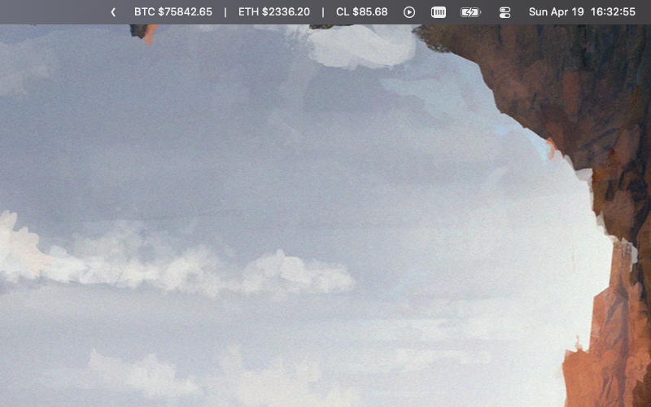

# Pulse

Minimal macOS menu bar app for live crypto prices, timezones, and custom labels.




## Features

### Multiple data sources
- **Binance** — spot and futures pairs (auto-detected), e.g. `BTCUSDT`, `ETHUSDT`
- **Hyperliquid** — perps and spot pairs, including `xyz:` aliases e.g. `BTC`, `xyz:TSLA`
- **Timezone clocks** — any IANA timezone, e.g. `America/New_York`

### Item types
- **Price pairs** — shows live price and 24h change percentage
- **Timezone clocks** — shows current time and UTC offset
- **Custom labels** — section headers for grouping
- **Separators** — visual dividers between groups

### Popup
- **Reorder** items by dragging
- **Show/hide** individual items from the menu bar via right-click → Show/Hide in Menu Bar
- **Rename** any item inline (right-click → Rename) — edits directly on the label, saved on blur or Enter
- **Delete** items via right-click → Delete
- **Add items** via the `+` button at the bottom:
  - Binance pair
  - Hyperliquid pair
  - Timezone
  - Label
  - Separator
- Click a price row to open it in the browser (Binance or Hyperliquid)

### Settings
Access via the gear icon at the bottom of the popup.

- **Separator** — character shown between items in the menu bar (default: none)
- **Padding** — number of spaces on each side of the separator (default: 1)

## Running

```bash
swift run
```
