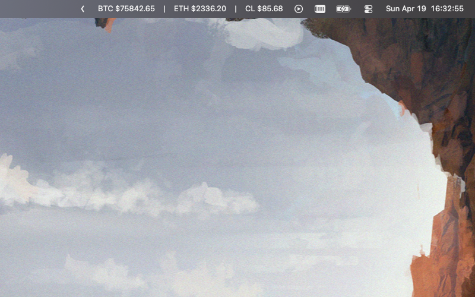
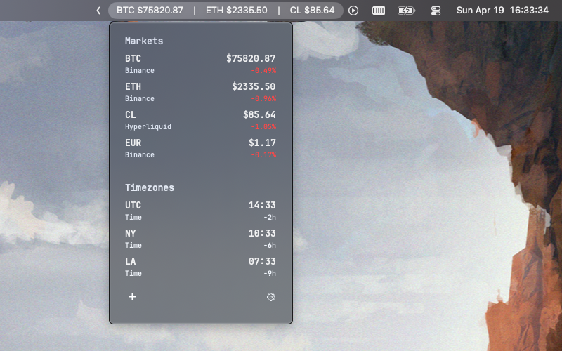

# Pulse

Minimal macOS menu bar app for live crypto prices, timezones, and custom labels.





## Features

### Multiple data sources
- **Binance** — spot and futures pairs (auto-detected), e.g. `BTCUSDT`, `ETHUSDT`
- **Hyperliquid** — perps and spot pairs, including `xyz:` aliases e.g. `BTC`, `xyz:TSLA`
- **Yahoo Finance** — stocks, ETFs, indexes, forex, commodities, and crypto e.g. `AAPL`, `^GSPC`, `EURUSD=X`, `BTC-USD`
- **Timezone clocks** — any IANA timezone, e.g. `America/New_York`

### Item types
- **Price pairs** — shows live price and 24h change percentage
- **Timezone clocks** — shows current time and UTC offset
- **Custom labels** — section headers for grouping
- **Separators** — visual dividers between groups

### Popup
- **Reorder** items by dragging
- **Show/hide** individual items from the menu bar via right-click → Show/Hide in Menu Bar
- **Rename** any item inline (right-click → Rename) — edits directly on the label, saved on blur or Enter
- **Delete** items via right-click → Delete
- **Add items** via the `+` button at the bottom:
  - Binance pair
  - Hyperliquid pair
  - Yahoo symbol
  - Timezone
  - Label
  - Separator
- Click a price row to open it in the browser (Binance, Hyperliquid, or Yahoo Finance)

### Settings
Access via the gear icon at the bottom of the popup.

- **Separator** — character shown between items in the menu bar (default: none)
- **Padding** — number of spaces on each side of the separator (default: 1)

## Install

Download the DMG from the [releases page](../../releases) and drag Pulse to
Applications. It's signed and notarised, so it opens without any warning.

Requires macOS 14 or later. Settings live in `~/.config/pulse/config.yaml`.

## Development

Plain SwiftPM, no Xcode project.

```sh
make bundle   # build and assemble dist/Pulse.app
make run      # the same, then launch it
make dev      # unoptimised build, replaces the running copy
make release  # signed, notarised, stapled DMG
```

`swift run` still works for a quick check, but it runs a bare executable rather
than the `.app`, so the menu bar item behaves slightly differently. See
`AGENTS.md` for how signing, notarisation and the rest of the pipeline fit
together.
